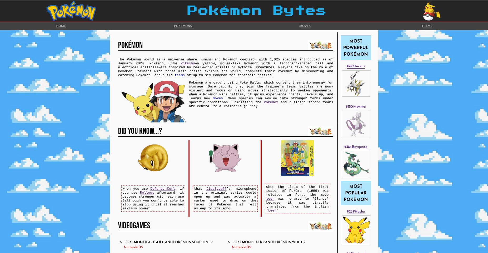
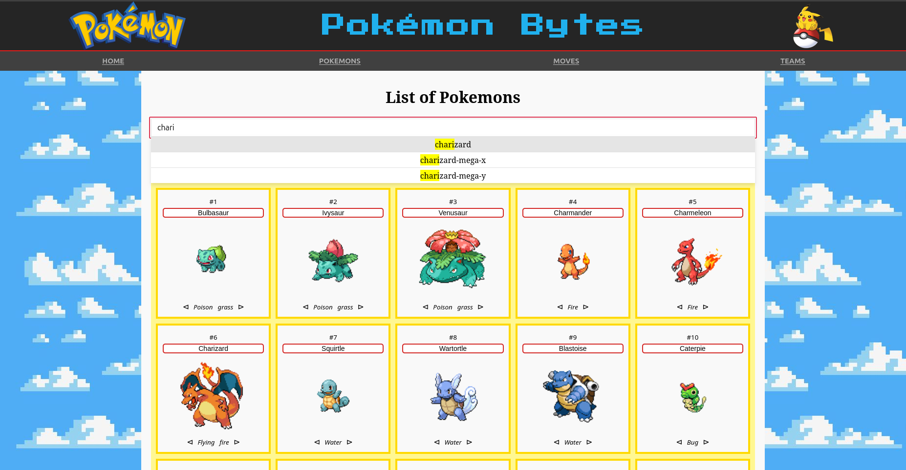
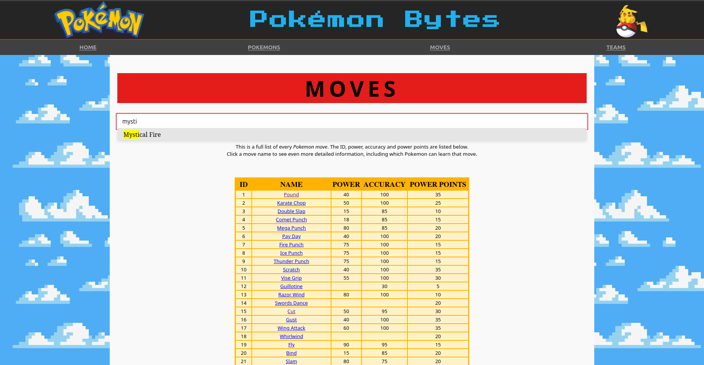

# POKEMON BYTES

Trabajo grupal desarrollado en la materia de Introducción al Desarrollo de Software

---

**Pokémon Bytes** es un proyecto full stack que combina un **backend en FastAPI** y un **frontend en Svelte** para gestionar y visualizar información relacionada con Pokemones.

El repositorio está organizado como un monorepo, donde frontend y backend conviven en un mismo proyecto pero se ejecutan de forma independiente.

---

## Estructura y flujo del proyecto

El flujo del proyecto sigue los siguientes pasos generales:
1. Levantar el backend
2. Levantar el frontend
3. Consumir la API desde la interfaz web

Cada parte se ejecuta por separado desde su respectiva carpeta.


### Backend

El backend está desarrollado con FastAPI y utiliza SQLAlchemy junto con Alembic para las migraciones de base de datos.

- Instrucciones completas en:

```
back/README_BACKEND.md
```

### Frontend

El frontend está desarrollado con Svelte y se comunica con la API provista por el backend.

- Instrucciones completas en:

```
front/README_FRONTEND.md
```
---

## Visualización

Algunas páginas principales:

- Página principal:
    <p align="center">
        
    </p>

- Lista de pokemones:
    <p align="center">
        
    </p>

- Lista de movimientos:
    <p align="center">
        
    </p>

- Teams creados por el usuario:
    <p align="center">
        
    </p>


Para ver más imágenes ver la carpeta `/img`.

---
## División del trabajo

Este proyecto fue desarrollado de manera colaborativa por un equipo de cuatro personas.

- **Gino Rizzuti** – [GitHub](https://github.com/Ginorris): configuración inicial del proyecto y repositorios, modelado de base de datos y migraciones iniciales, desarrollo y revisión de endpoints para Pokémon y Teams, implementación de seeds, y desarrollo del frontend (creación y edición de equipos, typeahead en listados).

- **Lourdes Lier** – [GitHub](https://github.com/lourdeslier): modelado de base de datos para habilidades y estadísticas, desarrollo y revisión de endpoints de consulta (Pokémon, Nature y Teams), y desarrollo del frontend (vistas de detalle de Pokémon y Teams, footer).

- **Melina Canal** – [GitHub](https://github.com/melicanal): modelado de base de datos para Moves, desarrollo y revisión de endpoints relacionados con Moves, ajustes sobre modelos existentes, y desarrollo del frontend (listado y detalle de Moves, navbar).

- **Qusisami Meza** – [GitHub](https://github.com/QusisamiMeza) · [LinkedIn](https://www.linkedin.com/in/qusisami-luciana-meza-taco-229b2839a/): modelado de base de datos (Species, Pokémon y Types), implementación de seeds, desarrollo y revisión de endpoints relacionados con Pokémon y Teams, y desarrollo del frontend (página de inicio, listado de Pokémon y listado de equipos).

La organización del trabajo se realizó utilizando Trello, lo que permitió una distribución equilibrada de tareas y un desarrollo coordinado del proyecto.

---

## Objetivos alcanzados

- Desarrollo de un backend que expone una API REST, respetando contratos de comunicación claros entre cliente y servidor.

- Implementación de un frontend web que consume la API y presenta la información de manera clara e interactiva.

- Integración completa entre frontend y backend.

- Uso de estructuras de datos y modelos para representar la información del dominio.

- Manejo de persistencia de datos mediante una base de datos y migraciones.

- Separación de responsabilidades entre frontend y backend, promoviendo una arquitectura modular y mantenible.

- Aplicación de buenas prácticas de desarrollo de software, incluyendo:

    - Organización del código.

    - Reutilización de componentes.

    - Claridad y legibilidad.

    - Uso de control de versiones con Git.

- Configuración de entornos de desarrollo reproducibles mediante el uso de entornos virtuales y gestión de dependencias.

- Desarrollo orientado a pruebas, incorporando tests automatizados para validar el funcionamiento del sistema.

- Desarrollo colaborativo en equipo, con división de responsabilidades y revisiones de código.

